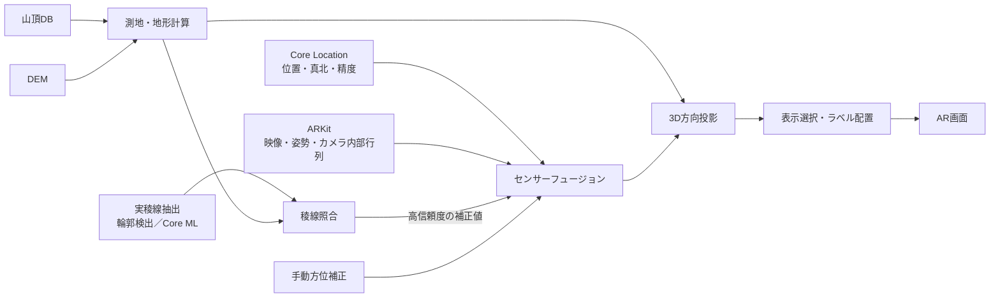
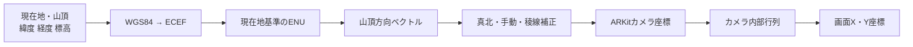
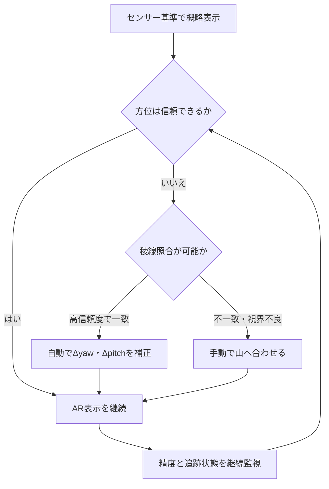
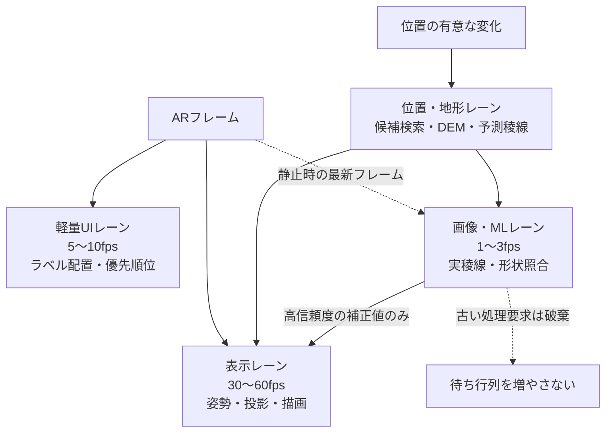
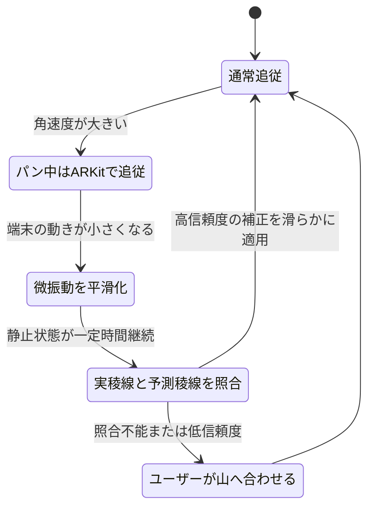
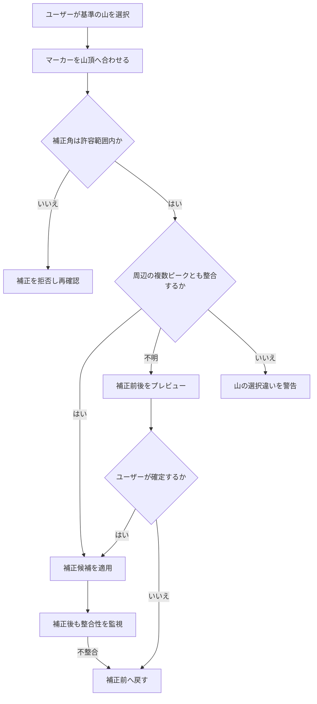
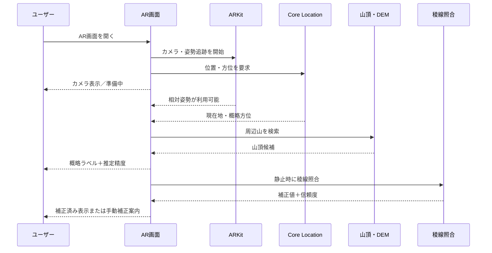
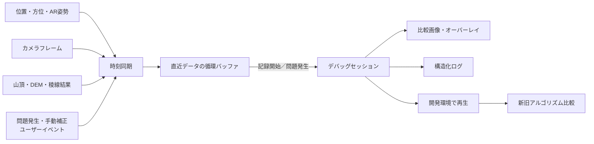

# YamaLens 山岳AR機能 補助設計資料

> 本書は、iPhoneのカメラ映像上で山を識別するYamaLensの技術設計書です。精度だけでなく、磁気干渉、手持ち時の揺れ、処理遅延、誤認防止を含むユーザー体験全体を設計対象とします。

## 設計の要点

- ARKitは短時間の相対姿勢追跡に使い、絶対方位の誤差は手動補正または稜線照合で補います。
- 山頂は実距離の3Dオブジェクトではなく、ECEF／ENUから求めた方向ベクトルとして投影します。
- DEMは遮蔽判定と予測稜線生成に使い、カメラから抽出した実稜線との照合で方位を補正します。
- Core MLは必要な場合に限り、空・山・雲・前景のセグメンテーションへ使用します。
- 描画を重い解析処理から分離し、通常時60fps、負荷時でも30fpsを下回らないことを目標とします。
- 山頂マーカーは追従性、文字ラベルは可読性を優先し、異なる強さで安定化します。
- 補正結果を無条件に信頼せず、複数ピークとの整合性、補正量、画像品質から採用可否を判断します。
- 自動補正できない場面では、候補表示、推定範囲、手動補正、地図表示へ安全にフォールバックします。
- 現地でしか発生しない問題を再現できるよう、同期ログ、比較画像、イベントマーカー、再生機能を段階的に整備します。

## 文書の位置づけ

本書は、iPhoneのカメラ映像に山名・標高・距離などを重ねて表示する
山岳AR候補表示について、技術構成、品質基準、実地試験方法を補足する設計資料である。

プロダクト判断、MVPの範囲、初期値、UIの文言・状態は、
`YamaLens_事前決定事項.md`、要求仕様書、基本設計書、UI設計書の順に従う。
本書に異なる記述がある場合は正本を優先し、本書を更新する。本書は、候補算出を
確定的な画像認識や安全判断として扱わない。

本機能の成功条件は、ラベルを山頂の1ピクセル上に固定することではない。
センサー誤差や手ブレが存在しても、ユーザーが目の前の山を取り違えず、
短時間で名称を判断できることを成功条件とする。


## 1. 目的

iPhoneのカメラを山へ向けたとき、画面上に次の情報をAR表示する。

- 山名
- 標高
- 現在地からの距離
- 山頂方向を示すマーカー
- マーカーとラベルを結ぶ指示線
- 現在の推定精度

ユーザーが「目の前に見えている山が何山なのか」を直感的に把握できる
体験を提供する。


## 2. 成功条件と対象外

### 2.1 成功条件

- 主要な山を短時間で識別できる
- 小さな手ブレでラベルが細かく振動しない
- 端末を大きく動かしたときは遅れすぎず追従する
- 誤差が大きい状態をユーザーが認識できる
- 絶対方位がずれた場合、ユーザーが簡単に補正できる
- 複数ピークが近接しても、ラベルと対象の対応関係が理解できる

### 2.2 初期段階で対象外とするもの

- 山頂へのピクセル単位の完全一致
- カメラ画像だけを使った山岳認識
- 高度な稜線画像マッチング
- 天候、雲、積雪、霞を考慮した画像認識
- 厳密な大気差補正
- 登山ナビゲーションや安全判断の代替


## 3. 基本設計方針

- 完全一致より、誤認しにくさを優先する
- 磁気コンパスの絶対方位には誤差があることを前提とする
- 金属や磁石付きケースなどによる磁気干渉で、絶対方位が大きく崩れる場合がある
- 短時間の相対姿勢はARKitを主に利用する
- 山頂方向は方位角、pitch、rollの個別差分ではなく、3Dベクトルとして扱う
- ARKitのカメラ姿勢とカメラ内部行列を使って画面へ投影する
- 山頂マーカーと文字ラベルを分離し、指示線で結ぶ
- ユーザーによる手動方位補正をMVPに含める
- 位置、方位、姿勢の精度と取得時刻を管理する
- 表示対象の選択とラベル配置には時間方向の安定性を持たせる
- 画像認識より先に、必要に応じてDEMによる簡易遮蔽判定を追加する
- 自動補正は、カメラ画像から抽出した実稜線とDEM予測稜線が十分に一致した場合だけ適用する


## 4. MVPの利用シナリオ

1. ユーザーが山の見える場所でAR画面を開く
2. カメラと位置情報の利用許可を確認する
3. 現在地、真北方向、ARKitの追跡状態を取得する
4. 周辺の山を検索し、画面内にある候補を表示する
5. 精度が低い場合は、その理由と改善方法を表示する
6. 方位がずれている場合、ユーザーがラベル全体を左右に補正する
7. 山のラベルをタップすると詳細情報を表示する


## 5. システム構成



### 5.1 Location Manager

Location ManagerとAR Session Managerはフレームワーク用アダプターとする。測地変換、
候補順位、精度評価、手動補正は、フレームワークに依存しないDomainの計算処理へ
時刻付き観測値として渡し、UIはその状態を描画する。

**担当:**

- 緯度、経度、標高の取得
- 水平精度、垂直精度の取得
- 位置情報の取得時刻管理
- 正確な位置情報が許可されているかの確認
- 真北方向と方位精度の取得

### 5.2 AR Session Manager

**担当:**

- カメラ映像の取得
- 端末の6DoF姿勢取得
- カメラ内部行列の取得
- 画面向きと表示領域に応じた座標変換
- ARKit trackingStateの監視
- フレーム時刻の管理

**推奨構成:**

- ARWorldTrackingConfigurationを利用する
- worldAlignmentはgravityAndHeadingを初期候補とする
- 実機評価で絶対方位の挙動を確認する
- 必要ならgravity基準のAR姿勢へ、別管理の真北補正角を合成する

### 5.3 Mountain Repository

**担当:**

- 山頂DBの読み込み
- 現在地周辺の候補検索
- 距離、標高、優先度などによる絞り込み
- データバージョンと出典の管理

### 5.4 Projection Engine

**担当:**

- 測地座標からローカル3D方向への変換
- カメラ座標への変換
- 画像平面への投影
- 画面内外とカメラ前後の判定
- ユーザー方位補正の適用

### 5.5 Visibility Engine

**担当:**

- 同一方向に重なる山の簡易抑制
- 表示優先順位の計算
- 将来はDEMによる見通し判定

### 5.6 Label Layout Engine

**担当:**

- ラベル衝突回避
- 指示線の生成
- 表示数の制限
- 前フレームの配置を考慮したちらつき防止

### 5.7 Accuracy Evaluator

**担当:**

- 位置精度、方位精度、データ鮮度、ARKit追跡状態の統合評価
- 推定精度の表示
- 利用困難時の案内


## 6. 入力データ

### 6.1 現在位置

**必要項目:**

- latitude
- longitude
- altitude
- horizontalAccuracy
- verticalAccuracy
- timestamp
- 位置情報の精度許可状態

**注意事項:**

- 古い位置情報を現在値として使わない
- horizontalAccuracyが負値または閾値を超える場合は利用しない
- verticalAccuracyが悪い場合は、仰角の信頼度を下げる
- GPS標高と山頂DBで標高基準が一致しているか確認する
- 将来は現在地標高をDEMから補正できるようにする

### 6.2 方位

**必要項目:**

- trueHeading
- magneticHeading
- headingAccuracy
- timestamp

**基本方針:**

- 利用可能な場合はtrueHeadingを使用する
- headingAccuracyが負値の場合は無効とする
- 画面向きに応じてheadingOrientationを正しく設定する
- 方位値はARKitの短時間の相対姿勢と組み合わせて使用する
- 方位ジャンプを検知し、即座に表示へ反映しない

### 6.3 ARKitカメラ情報

**必要項目:**

- camera.transform
- camera.intrinsics
- imageResolution
- trackingState
- ARFrame.timestamp
- displayTransform
- interfaceOrientation
- viewportSize

**注意事項:**

- FOVだけによる近似投影は、説明用または検証用に限定する
- 実表示はintrinsicsとARKitの表示変換を基準にする
- 縦画面、横画面、Safe Area、映像のクロップを考慮する
- レンズやズームを変更する場合、投影条件も更新する

### 6.4 山頂データベース

**最低限必要な項目:**

Mountain
- id
- name
- latitude
- longitude
- altitude

**推奨追加項目:**

- nameKana
- aliases
- mountainRange
- prefectures
- prominence
- isMajor
- displayPriority
- dataSource
- dataVersion

**運用上の注意:**

- 座標、標高、名称の出典とライセンスを記録する
- 同名の山をidで識別する
- 別名、旧字体、読み仮名を扱えるようにする
- DB更新時に既存idを安定させる


## 7. 座標系と投影



### 7.1 基準座標系

緯度、経度、標高から直接、角度差だけを計算するのではなく、
次の座標変換を基本とする。

1. 現在地と山頂をWGS84測地座標として扱う
2. 両地点を地球中心直交座標ECEFへ変換する
3. 現在地を原点とするローカルENU座標へ変換する
4. 現在地から山頂への方向ベクトルを正規化する
5. 真北補正とユーザー補正を適用する
6. ARKitのカメラ姿勢でカメラ座標へ変換する
7. カメラ内部行列で画面座標へ投影する

**ENUの軸:**

- X: East
- Y: North
- Z: Up

実装内でARKit座標系へ変換する際は、軸の向きと右手系を明示し、
変換行列を単体テストする。

### 7.2 遠距離の扱い

50kmから100kmの距離では地球曲率を無視しない。
ECEFからENUへの変換により、単純な高度差と水平距離による近似よりも
一貫した山頂方向を求める。

大気差はMVPでは補正しない。ただし、遠距離・低仰角の山では誤差要因に
なることを記録する。

### 7.3 AR空間内の距離

実距離100kmの位置へそのまま3Dオブジェクトを配置しない。
浮動小数点精度と不要な並進視差を避けるため、山頂は方向ベクトルとして扱う。

表示用マーカーは、カメラから一定の仮想半径上に置くか、
方向ベクトルを直接2D投影する。


## 8. 基本処理フロー

AR画面開始
↓
権限とデバイス対応状況を確認
↓
ARKitセッション開始
↓
現在位置と方位を取得
↓
位置・方位・姿勢の有効性と取得時刻を検証
↓
周辺の山を検索
↓
各山のECEF・ENU方向、距離、仰角を計算
↓
明らかに対象外の山を除外
↓
ユーザー方位補正を適用
↓
ARKitカメラ座標へ変換
↓
画面へ投影
↓
表示優先順位を計算
↓
時間方向の安定化とラベル衝突処理
↓
マーカー、指示線、ラベル、推定精度を描画


## 9. 更新頻度とキャッシュ

処理ごとに必要な更新頻度を分離する。

**毎ARフレーム:**

- カメラ姿勢の更新
- 既存候補の画面投影
- マーカー描画

**数フレームごと、または10Hz程度:**

- ラベル配置の更新
- 表示優先順位の軽量な再評価

**位置が一定距離以上変化したとき:**

- 周辺山検索
- 距離、ENU方向の再計算
- 簡易遮蔽判定

**例:**

- 徒歩利用では現在地が100mから500m変化したら候補を更新
- 位置精度より細かい移動では不要な再計算をしない
- 周辺検索結果はキャッシュする


## 10. 周辺山の抽出

全国の山を毎フレーム計算しない。

**初期候補:**

- 検索最大距離は正本の初期値どおり150kmとする
- 実装では、固定リプレイと実地検証の根拠がある場合に限り、設定値型を通じて候補範囲を縮小できる
- 空間インデックス、タイル、Geohash、R-treeなどを利用する

**候補の優先要素:**

- 画面中央からの角度
- 距離
- 標高
- プロミネンス
- 主要山フラグ
- 表示優先度
- 現在の推定可視性
- 直前まで表示されていたか


## 11. 可視性と山の重なり

### 11.1 DEM読み込み不可時の縮退

完全な遮蔽判定はできないため、次の簡易処理を行う。

- ほぼ同じ方位と仰角に複数の山がある場合はクラスタ化する
- 近い山、主要な山、視線上で仰角が高い山を優先する
- 曖昧な場合は代表ラベルと候補数を表示できるようにする
- 遮蔽未判定の情報を内部状態として保持する

この縮退状態では「DB上はその方向にあるが、実際に見えるとは限らない」ことを
明記し、精度低下理由と検索・手動選択への導線を表示する。通常のMVP候補算出では、
導入済みパックのDEMを使って遮蔽候補のscoreを下げる。

### 11.2 DEM導入後

- 現在地から山頂までの地形断面をサンプリングする
- 途中地形の仰角が山頂仰角以上なら遮蔽候補とする
- 境界付近では完全に消さず、優先度を下げる
- 低解像度DEMの誤差を考慮して安全余裕を設ける

DEMは稜線画像マッチングより先に導入する。


## 12. センサーフュージョン

**基本思想:**

- 短時間の滑らかな回転追従はARKitを重視する
- 長時間の絶対方位はCore Locationの真北方位で補正する
- 磁気方位を毎フレーム直接ラベルへ反映しない
- 急激な方位変化は外れ値として扱う
- ユーザー補正を最終的な絶対方位オフセットとして適用する
- 磁気干渉が疑われる場合は、コンパス値を過信せず、手動補正または稜線照合を優先する

状態として少なくとも次を分離する。

- ARKitによる相対姿勢
- システムが推定した真北オフセット
- ユーザーが設定した手動補正オフセット
- 稜線照合で得た自動補正オフセットと信頼度
- 各値のtimestampと信頼度


## 13. 手動方位補正

### 13.1 MVP要件

手動方位補正はMVPに含める。

**操作案:**

- 二本指または専用操作でラベル全体を左右に移動する
- 補正モード中は「方位補正中」と明示する
- 補正角を「東へ4°」などと表示する
- リセットボタンを設ける
- ドラッグ操作が難しい利用者向けに、左右へ少しずつ補正する単一タップ操作も用意する
- 既知の山を選び、マーカーを山頂に合わせて確定できるようにする
- 方位精度が低い場合は、補正操作を最初に提案する

### 13.2 補正値の保持

- 原則としてARセッション単位で保持する
- 場所、端末姿勢、周囲の磁気環境が変わるため、恒久保存を前提にしない
- 位置が大きく移動した場合やセッション再開時は、再確認を促す


## 14. 平滑化と外れ値処理

### 14.1 目標

- 小さな手ブレとセンサーノイズを吸収する
- 意図的な大きなカメラ移動には素早く追従する
- 絶対方位の急なジャンプで全ラベルが飛ばないようにする

### 14.2 基本方式

固定係数の指数移動平均だけでなく、変化量に応じて係数を変える。

- 変化が小さい場合: 強い平滑化
- 変化が大きい場合: 追従を速くする
- 一定角度を超える瞬間的変化: 外れ値候補として保留
- 複数回継続した変化: 新しい方位として採用

角度の平均では0°と360°の境界を正しく扱う。
可能であれば姿勢はQuaternionまたは回転行列で補間する。

### 14.3 表示位置の平滑化

センサー値だけでなく、画面上のラベル位置にも軽い平滑化を適用できる。
ただし山頂マーカーの遅延とラベル配置の遅延を別々に調整する。


## 15. ラベル表示

**基本表示:**

  富士山
  3,776m・32.4km
       |
       ▼

**設計方針:**

- マーカーは計算上の山頂方向を示す
- 文字ラベルは読みやすい位置へ移動できる
- マーカーとラベルを指示線で結ぶ
- 距離と標高は視認性を妨げない大きさにする
- ラベルの背景に半透明のコントラストを設ける
- VoiceOver用の読み上げ情報を用意する

**タップ時の詳細例:**

富士山
標高: 3,776m
距離: 32.4km
方位: 256°
推定方位誤差: 参考値


## 16. ラベル衝突処理

山頂マーカー自体は移動せず、文字ラベルを移動して指示線で接続する。

**配置条件:**

- ラベル同士を重ねない
- 重要なマーカーをラベルで隠さない
- 指示線の交差をできるだけ減らす
- 画面外やSafe Area外へ出さない
- 表示するラベル数に上限を設ける

**時間方向の安定化:**

- 前フレームの配置を優先する
- 少し順位が変わっただけでは入れ替えない
- 表示開始と表示終了に異なる閾値を使う
- 一度表示したラベルは最低表示時間を設ける
- 頻繁な上下移動や点滅を防止する


## 17. 推定精度表示

表示名称は「AR精度」より「推定精度」を推奨する。

**評価に使う要素:**

- headingAccuracy
- horizontalAccuracy
- verticalAccuracy
- 各センサー値の経過時間
- ARKit trackingState
- ユーザー補正の有無
- 稜線照合による自動補正の有無と信頼度
- 位置情報の精度許可状態

**表示の考え方:**

高・中・低・利用困難の状態は、事前決定事項13.5節の位置・方位・垂直精度、
観測値の有効時間、候補scoreとARKit追跡状態から決める。閾値や表示数はここで
再定義せず、変更時は正本、境界テスト、固定リプレイ、現地ログを同じ変更に含める。

**表示例:**

- 推定精度: 高
- 方位誤差の目安: 利用可能な場合に表示
- 方位が不安定です。周囲の金属から離れてください
- 磁気の影響を受けている可能性があります。ケースを外すか、画面上で山に合わせてください
- 地形と照合して補正済み
- 位置情報を確認しています
- 端末をゆっくり動かしてください


## 18. エラー状態と復旧

### 18.1 位置情報が取得できない

- 権限状態を説明する
- 設定画面への案内を表示する
- 古い位置で表示を続けず、一時停止する

### 18.2 方位が不正確

- 精度低下を明示する
- 周囲の金属や磁石付きケースから離れるよう案内する
- 手動方位補正を提案する

### 18.3 ARKit追跡が不安定

- ラベルを薄くする、または一時停止する
- 端末をゆっくり動かすよう案内する
- 追跡復旧後に急激な表示ジャンプが起きないよう遷移させる

### 18.4 アプリ復帰・画面回転・中断

- セッション中断前の姿勢を盲目的に再利用しない
- 必要に応じて方位と手動補正を再確認する
- 画面向き変更時に投影座標を再構成する


## 19. パフォーマンスと電力

- 全国DBの全件走査を行わない
- 測地計算結果を現在地単位でキャッシュする
- 毎フレーム行う処理を投影中心に限定する
- ラベル衝突処理の更新頻度を抑える
- 高精細カメラ、不要なARKit機能、過剰なDEM処理を常時有効にしない
- 発熱時や低電力状態では表示数や更新頻度を下げられるようにする
- 重い処理が終わるのを待って描画を止めない


## 20. プライバシー、オフライン、データ運用

- 位置情報とカメラの利用目的を明確に説明する
- MVPでは「使用中のみ」の位置情報権限を基本とする
- 撮影や画像保存を行わない場合は、そのことを説明できるようにする
- 基本的な山頂DBは端末内で利用可能にする
- オフライン時に利用できない機能を明確にする
- 山頂DBとDEMの出典、ライセンス、更新日を管理する


## 21. 安全上の位置づけ

- 本機能は山岳ナビゲーション、安全確認、登山判断の代替ではない
- 歩行中の画面注視を促さない
- 崖、道路、悪天候など危険な場所での利用に注意を表示する
- 誤差が大きい状態で確定的な案内表現を使わない


## 22. MVP実装範囲

**入力:**

- GPS現在地と精度
- Core Locationの方位と精度
- ARKitの端末姿勢、カメラ映像、intrinsics、追跡状態
- 山頂DB
- 導入済みパックのDEM

**アルゴリズム:**

- 周辺山検索
- WGS84 / ECEF / ENU座標変換
- 距離と山頂方向の計算
- ARKitカメラ座標への変換
- intrinsicsを使った画面投影
- センサー値の鮮度管理
- 適応型平滑化と外れ値処理
- 表示対象選択
- 同一方向の山の簡易クラスタ化
- DEMによる遮蔽候補の減点（遮蔽が疑われても即時削除しない）
- 安定性を考慮したラベル配置
- 手動方位補正
- 推定精度評価

**出力:**

- 山名
- 標高
- 距離
- 山頂方向マーカー
- 指示線
- 推定精度
- 補正状態


## 23. MVPでは実装しないもの

- AI画像認識
- カメラ画像からの山頂認識
- 稜線画像マッチング
- 高精度な大気差補正
- 積雪、雲、霞を考慮した可視性判定
- 山頂へのピクセル単位の完全一致
- 恒久的な自動キャリブレーション

**注記:**

低解像度DEMによる遮蔽判定は、固定入力による技術試作では省略できる。ただし、
導入済みパックを使うMVPの候補算出では正本の初期値に従って利用する。


## 24. 実装フェーズ

### Phase 0: 数学・投影検証

- 既知の現在地と山頂座標からENU方向を計算
- 端末姿勢を固定したテストで画面座標を検証
- 0°/360°、画面回転、roll、カメラ後方をテスト
- 磁気干渉を想定した方位オフセットを注入し、手動補正で復旧できることをテスト

### Phase 1: 技術試作

- GPS + 方位 + ARKit + 山頂DB
- 3D方向ベクトルによるAR投影
- 簡易ラベル表示
- ログ記録
- ケースあり、なしを含む方位誤差の計測
- 固定入力でのDEM遮蔽候補の減点と縮退状態の検証

### Phase 2: 製品MVP

- 手動方位補正
- 推定精度表示
- 適応型平滑化
- 安定したラベル衝突処理
- 山の重なりの簡易処理
- DEMによる見通し・遮蔽候補の減点
- エラー状態と復旧UI
- ケースや周囲金属による方位低下の案内

### Phase 3: MVP後の高精度地形対応

- DEMによる現在地標高補正
- DEMによる見通し、遮蔽判定
- 予測稜線生成
- 通常の輪郭検出による実稜線抽出の検証

### Phase 4: MVP後の自動方位補正

- カメラ画像から実際の稜線を抽出
- 予測稜線と実稜線をマッチング
- 磁気コンパスの方位誤差を自動補正
- 低コントラスト、雲、逆光などで通常の輪郭検出が不足する場合のみ、Core MLの軽量セグメンテーションモデルを導入する
- ローカルLLMは幾何学的な位置合わせには使用しない


## 25. テスト方針

### 25.1 単体テスト

- 2地点間距離
- ECEF変換
- ENU変換
- 既知方位と仰角
- ARKit座標系との軸変換
- カメラ前方、後方判定
- 0°/360°境界
- 縦画面、横画面
- 方位補正角の適用とリセット
- 古いセンサー値の無効化

### 25.2 シミュレーションテスト

- 現在地と端末姿勢を固定入力できる診断モードを用意する
- 山頂方向、カメラ座標、画面座標をログ表示する
- センサーノイズと方位ジャンプを再現する
- ラベルが頻繁に入れ替わらないことを確認する

### 25.3 実地試験

**環境:**

- 開けた展望地点
- 市街地の展望台
- 鉄骨や車両の近く
- 近距離の山
- 50km以上離れた山
- 複数ピークが近接する場所

**端末条件:**

- 複数のiPhone世代
- 磁石付きケースあり、なし
- 縦画面、横画面
- アプリ起動直後、30秒後
- 低電力状態、発熱状態

**測定項目:**

- 横方向の角度誤差
- 縦方向の角度誤差
- 補正前後の誤差
- 静止時のマーカー揺れ
- 大きく振った後の追従時間
- ラベル配置変更の回数
- 同方向の山の誤認率
- 初回表示までの時間
- バッテリー消費と端末温度
- ユーザーが正しい山を識別できた割合


## 26. MVPの暫定合格基準

数値は実地試験結果に応じて更新する。

**機能:**

- 権限取得後、AR表示を開始できる
- 縦画面と横画面で投影方向が一致する
- 手動補正を適用、確認、リセットできる
- 精度低下時に理由を表示できる

**識別性:**

- MVPの合格は、正本で定める代表テスト地点において、目視可能な主要ピークを候補一覧に安定して提示できることとする
- 手動補正後は、近接ピークを除く主要山を明確に区別できる
- 誤認を招く重複ラベルが継続表示されない
- 磁気干渉を模擬した条件でも、手動補正後に識別性を回復できる

**安定性:**

- 静止時に文字が読めないほど振動しない
- 通常のパン操作で追従遅れが不快にならない
- ラベル配置が短時間に繰り返し入れ替わらない

**信頼性:**

- 無効または古い方位、位置を正常値として使用しない
- ARKit追跡不能時に確定的なラベル表示を続けない
- 自動補正の信頼度が低い場合は補正を適用しない

**応答性:**

- 通常操作時、カメラ映像に対するラベル追従が明らかに遅れない
- 重い画像処理中でもカメラ表示と基本ラベル描画を止めない
- 対象Proモデルで、低電力状態や発熱時には品質を段階的に落として基本表示を継続できる


## 27. ログと計測

実地試験用ビルドでは、個人情報の扱いに配慮しながら次を記録できるようにする。

- 位置と各精度値
- 方位とheadingAccuracy
- ARKit trackingState
- システム方位補正値
- ユーザー補正値
- 選択された山id
- 計算上の方位、仰角、画面座標
- ラベル表示、非表示理由
- フレーム時刻と処理時間

ログは問題の再現と閾値調整のために使用し、通常版では必要最小限とする。


## 28. 技術試作で確認する事項

次の技術詳細は、正本の決定を変更せずに、固定リプレイと実地試験で確認する。

- 手動補正の具体的な操作量と、単一タップ操作の刻み幅
- 縦画面・横画面それぞれの投影座標とSafe Areaの扱い
- 使用する山頂データの出典・ライセンス・再配布条件
- 対象Proモデルでの処理時間、電力、発熱と更新頻度
- DEM解像度と容量・遮蔽候補の有用性


## 29. 磁気干渉を前提にした精度向上方針



### 29.1 問題の位置づけ

既存の山岳ARアプリでは、山名ラベルが大きくずれる、金属や磁石付きの
ケースを装着すると合わない、といった利用者の指摘が起こりやすい。

主な原因は、磁気コンパスが示す絶対方位の誤差である。
ARKitは端末の短時間の相対的な動きを滑らかに追跡できるが、
磁気干渉で狂った「北」の基準を単独では正せない。

このため、全ラベルが同じ方向にまとまってずれる状態を、
通常のセンサーノイズとは別の「絶対方位不良」として扱う。

### 29.2 補正の優先順位

第1段階: センサー基準の概略表示

- Core Locationの真北方位とARKit姿勢を使って表示する
- headingAccuracy、取得時刻、ARKit追跡状態を常に監視する

第2段階: ユーザーによる確実な補正

- ユーザーが既知の山へマーカーを合わせる
- またはラベル全体を左右へ移動して補正する
- 補正後の方位オフセットをセッション内で適用する

第3段階: 地形を基準にした自動補正

- DEMから現在地で見えるはずの予測稜線を生成する
- カメラ画像から実際の山と空の境界である実稜線を抽出する
- 両方の形状を照合して、方位補正Δyawと上下補正Δpitchを求める
- 一致度が十分高い場合だけ補正を適用する

### 29.3 Core MLの役割

Core MLは、山名を直接推測したり、補正角を文章モデルに判断させたりする
目的では使わない。

Core MLを使う候補は、画像の各画素を次のように分類する軽量な
セグメンテーションモデルである。

- 空
- 山、地形
- 雲
- 樹木、建物などの前景

これにより、霞、逆光、雲、雪、前景遮蔽物などで通常のエッジ検出だけでは
不安定になる実稜線を、より安定して取り出すことを狙う。

**導入順序:**

1. 通常の画像処理、輪郭検出で実稜線を抽出する
2. DEM予測稜線との形状照合を実装する
3. 現場データで失敗条件を分類する
4. その失敗が稜線抽出に起因すると確認できた場合だけCore MLを追加する

ローカルLLMは、方位やピクセル位置を安定して計算する用途には向かないため、
精度補正の構成要素に含めない。将来使う場合は山の説明や会話型ガイドなど、
表示内容の付加価値に限定する。

### 29.4 自動補正の安全条件

次の条件をすべて満たした場合にだけ自動補正を適用する。

- ARKitの追跡状態が正常
- 実稜線として有効な画面幅が十分にある
- 予測稜線との一致度が閾値以上
- 補正角が前回値から急変していない
- 雲、前景、霞による不確実性が許容範囲内

満たさない場合は、補正しない。既存の補正値を急に書き換えず、
「推定精度: 低」と手動補正の導線を表示する。

### 29.5 推奨するユーザー体験

- 通常時: 山名ラベルと推定精度を表示する
- 方位が低精度: 金属や磁石付きケースの影響の可能性を簡潔に表示する
- 手動補正可能: 「山に合わせる」操作を表示する
- 地形照合成功: 「地形と照合して補正済み」と表示する
- 地形照合失敗: 断定的な位置合わせをせず、補正前提のUIに留める


## 30. 処理時間と描画応答性



### 30.1 基本原則

AR表示の描画、候補検索、DEM処理、稜線抽出、Core ML推論を同じ更新周期で
同期実行しない。

カメラを動かしたときのラベル追従は、重い処理を待たずにARKit姿勢だけで
継続する。一方、地形照合や画像認識の結果は非同期で取得し、信頼できる
新しい結果だけを補正値として反映する。

### 30.2 更新レーンの分離

表示レーン: 毎ARフレーム、目標30から60fps

- ARKitカメラ姿勢の取得
- 既存候補のカメラ座標への変換
- 画面投影とマーカー描画
- 前回確定した補正値の適用

軽量UIレーン: おおむね5から10fps

- ラベル衝突処理
- 表示優先順位の再評価
- ラベル位置の安定化
- 精度表示の更新

位置・地形レーン: 現在地が有意に移動した時、または低頻度

- 周辺山検索
- 距離と方向の再計算
- DEMによる遮蔽判定
- 予測稜線生成

画像・MLレーン: 非同期、目標1から3fps、端末状態により低下可能

- 入力フレームの縮小
- 実稜線の輪郭抽出またはCore ML推論
- 予測稜線との形状照合
- 補正候補と信頼度の算出

画像・MLレーンが遅れている場合は、処理待ちフレームをためない。
古いフレームを捨て、最新の利用可能なフレームだけを処理する。

### 30.3 暫定パフォーマンス目標

端末差を考慮して実測で調整するが、初期の目標を次のように置く。

- 姿勢取得、候補投影、描画準備: 1フレームあたり概ね8ms以内
- 表示レーン: 通常時60fps、負荷時は30fpsを下回らない
- ラベル配置: 表示レーンを止めず、別レーンで数msから十数ms程度
- 稜線抽出またはCore ML: 1回あたり100ms程度を上限目標とし、非同期で実行
- 地形照合結果: 画面を静止させた後、おおむね1秒以内に反映
- カメラ映像に対するラベルの見かけの遅延: 通常利用で不快に感じない範囲を実機評価する

数値は対象Proモデルごとに記録し、低電力状態や発熱時は表示数、画像解析の解像度、
解析頻度を下げて応答性を優先する。

### 30.4 負荷制御

- 山頂候補数と最大ラベル数に上限を設ける
- 画面外の候補には衝突処理や詳細な描画を行わない
- 稜線抽出には縮小画像と、空があり得る画面上部などのROIを用いる
- モデルは起動時またはAR画面遷移時に事前ロードする
- Core ML推論は直列キューで実行し、推論中は次の古い要求を破棄する
- 端末温度、低電力モード、メモリ警告を監視して解析頻度を下げる
- 発熱時は、まず稜線照合の頻度と表示ラベル数を下げ、基本表示は維持する


## 31. 手持ち時の揺れと追従性



### 31.1 揺れの種類

手持ち利用で発生する揺れは、同じ方式で一律に消さない。

- 高周波の微振動: 手ブレ、呼吸、歩行
- 中程度の意図しない変化: 手首の揺れ、姿勢変更
- 大きな意図的移動: 山を探すパン、見上げる動作
- 絶対方位の急変: コンパス干渉、センサー異常

高周波の微振動だけを抑え、大きな意図的移動は遅れずに追従させる。

### 31.2 表示の安定化

- 姿勢はQuaternionまたは回転行列として扱い、適応型の平滑化を適用する
- 小さな角速度では平滑化を強める
- 大きな角速度では平滑化を弱め、素早く追従する
- ラベル位置には、マーカーより少し強い画面上の平滑化を適用する
- ラベルの表示、非表示、配置変更にはヒステリシスと最低表示時間を設ける
- 絶対方位の大きな変化は、短時間の補間なしに全ラベルへ適用しない

マーカーは地形上の推定方向を示すため追従を優先し、文字ラベルは読みやすさを
優先してわずかに安定化する。この二つを同じ係数で動かさない。

### 31.3 時刻同期

ARFrame、方位、位置、画像解析結果にはそれぞれ取得時刻がある。

- ARフレームの姿勢は同じフレームのカメラ画像へ対応させる
- 遅れて届いた方位や位置を無条件に現在の姿勢と組み合わせない
- 稜線照合の補正値には、入力画像の時刻、端末姿勢、信頼度を保存する
- 結果が古すぎる場合は破棄し、補正に使わない

### 31.4 稜線照合を行うタイミング

実稜線の抽出と照合は、端末が大きく揺れている最中に無理に行わない。

- ジャイロの角速度が低い状態が一定時間続いた時に優先して解析する
- 画像のブレ量や露出変化が大きいフレームは解析対象から外す
- ユーザーが1秒程度端末を止めると精度を上げられるUIを用意する
- パン中は既存の補正値とARKit追従で表示を維持する

### 31.5 自動補正の反映

新しい補正値は、信頼度が高くても一瞬で適用しない。

- 小さな補正は数百ms程度で滑らかに反映する
- 大きな補正は追加の一致確認を行う
- 補正中に信頼度が下がったら、新しい補正の適用を中止する
- 補正値が連続して安定した場合にだけ確定値として保持する

### 31.6 揺れと遅延の実地試験

- 静止時のマーカー位置のばらつき
- 歩行中のラベル可読性
- 通常のパン操作時の追従遅延
- 急停止後にラベルが落ち着くまでの時間
- 方位補正後、揺れによって補正が崩れないこと
- 金属ケースあり、なしでの追従性と補正成功率
- 画像・ML処理を有効、無効にした場合のフレームレート、電力、発熱


## 32. 補正の安全性と不確実性

### 32.1 誤った手動補正の防止

ユーザーが別のピークを正しい山だと思って合わせると、全ラベルが誤った方向へ
補正される。このため、手動補正値を即座に確定値として扱わない。



安全条件:

- 補正可能角度に上限を設ける。初期値は左右それぞれ20°程度を候補とする
- 選択した山だけでなく、周辺の複数ピークとの残差も確認する
- 補正前後を切り替えて比較できるようにする
- 補正した山名、補正角、確定時刻を表示または内部記録する
- 取り消しとリセットを常に可能にする
- 位置が大きく変化した場合、以前の補正値を自動的に確定利用しない

### 32.2 山ごとの不確実性

「推定精度: 高・中・低」は画面全体の状態を示すが、実際の誤差は山ごとに異なる。
各山について、少なくとも次の不確実性を内部的に管理する。

- 水平方向の推定角度誤差
- 垂直方向の推定角度誤差
- 距離誤差
- 遮蔽判定の信頼度
- 稜線照合との整合度
- 表示中の候補と近接ピークの曖昧さ

影響の例:

- 遠距離の山では、数十mの現在地誤差による方位影響は比較的小さい
- 近距離の山では、同じ現在地誤差でも方向が大きく変わる
- 低仰角の遠方山では、標高基準、地球曲率、大気差の影響が増える
- 磁気干渉では、多数の山がほぼ同じ方向へ一括してずれる

UIでは数値を常に表示する必要はない。必要に応じて、山頂マーカーの周囲に
薄い範囲、帯、扇形などを表示し、「この範囲にある」という不確実性を表現する。

### 32.3 自動補正する変数の制限

稜線照合から多くのパラメータを同時推定すると、偶然一致した誤った解を
選びやすくなる。

導入順序:

1. 左右方向のyawだけを補正する
2. 十分な長さの稜線が一致した場合のみpitchも補正する
3. roll、FOV、画像中心は原則としてARKitとカメラ情報を使用する
4. FOVなどの追加推定は、実測で必要性が確認された場合だけ導入する

補正値には上限、変化率制限、前回値との整合性確認を設ける。


## 33. カメラ構成の制限と拡張

### 33.1 MVPの対応範囲

レンズ切り替えやデジタルズームは、カメラ内部行列、映像クロップ、安定化範囲へ
影響する。MVPでは条件を制限して投影誤差を減らす。

- 標準の背面カメラを基本とする
- 正本で定める1x／2x／3xの段階操作を提供し、倍率変更時はintrinsics、画像解像度、表示変換を再取得して投影を更新する
- AR表示中の自動レンズ切り替えを避ける
- 対応する画面方向を明確にする
- 対応外のレンズやズーム操作は無効化するか、実験機能として分離する

### 33.2 将来の複数レンズ対応

複数レンズへ対応する場合は、レンズ変更ごとに次を再取得・再計算する。

- camera.intrinsics
- imageResolution
- displayTransform
- 映像のクロップ領域
- ズーム倍率
- レンズ歪みと画像中心

レンズ変更中は以前の投影値を使い続けず、短時間「カメラを調整中」として
ラベルの確定表示を抑制する。


## 34. 稜線抽出が利用できない状態

### 34.1 解析を開始しない条件

次の場面では、実稜線とDEM予測稜線による自動補正を開始しない。

- 山または空が画面内にほとんど存在しない
- 樹木や建物などの前景が大半を占める
- 雲、霧、霞により山と空の境界が不明瞭
- 夜間または露出不足
- 強い逆光、白飛び、黒つぶれ
- ピンぼけまたはモーションブラー
- カメラが大きく動いている
- 自動露出やレンズ切り替えの途中

### 34.2 独立した状態管理

「補正に失敗した」と「補正に適した画像が得られていない」を区別する。

- `notReady`: 端末移動中、露出調整中など
- `insufficientScene`: 山または空が不足
- `lowImageQuality`: ブレ、霞、逆光など
- `noReliableMatch`: 稜線は取得できたがDEMと一致しない
- `matched`: 十分な信頼度で一致

利用できない場合は推論を繰り返して電力を消費せず、条件が改善した時点で
解析を再開する。


## 35. Core MLとDEMの運用

### 35.1 Core MLモデル管理

- モデル名、バージョン、学習データ版、対応iOSを記録する
- 山域、季節、天候、時刻、積雪、端末世代ごとに評価する
- 新旧モデルで補正成功率、誤補正率、処理時間、電力を比較する
- 新モデルに問題がある場合、以前のモデルへ戻せるようにする
- 学習画像と評価画像は、連続フレームではなく撮影地点や山域単位で分離する
- 端末内推論を基本とし、画像を保存・送信する場合は明示的な同意を得る

モデル評価では、稜線抽出率だけでなく、その後の方位補正が正しくなったかを
最終指標とする。

### 35.2 DEMの解像度と保存

- 低解像度DEMで候補の遮蔽と大まかな稜線を計算する
- カメラが向いている方向だけ、必要に応じて高解像度タイルを読む
- タイル単位でキャッシュし、現在地から遠いデータを常時展開しない
- 欠損値、海域、標高基準、データ境界を扱う
- 樹木、建物、積雪はDEM地表面と一致しないことを前提とする
- データ出典、ライセンス、更新日、解像度をメタデータとして保持する

オフライン利用は、正本どおり山域単位のパックを手動導入する。全国一括搭載や
現在地半径だけによる配布はMVPの対象外とする。


## 36. 起動時の段階的な体験

AR画面を開いた直後は、必要な情報が同時には揃わない。待ち時間中に空白画面や
誤った確定表示を出さず、利用可能な情報の増加に合わせて段階的に表示する。



表示状態の例:

- カメラを開始しています
- 現在地を確認しています
- 山の方向を推定しています
- 概略位置を表示中
- 地形と照合して補正済み
- 地形照合ができないため手動補正を利用できます

最初のラベルが出るまでの時間と、補正済みになるまでの時間を別々に計測する。


## 37. 基準展望地点と回帰テスト

### 37.1 基準データ

アルゴリズム変更前後を同じ条件で比較できるよう、複数の基準展望地点を用意する。

記録項目:

- 正確な撮影位置と標高
- 撮影方向と端末姿勢
- 主要ピークの正しい画像座標
- 山頂id
- iPhone機種、iOS、レンズ、ズーム
- ケースと周辺磁気環境
- 天候、視程、時刻、季節
- 使用した山頂DB、DEM、Core MLモデルのバージョン

### 37.2 比較指標

- 補正前後のyaw、pitch誤差
- 静止時のマーカー位置の分散
- パン停止後に安定するまでの時間
- 稜線抽出成功率
- 稜線照合成功率
- 正しい補正率
- 誤った方向へ補正した率
- 手動補正が必要だった率
- 山の識別正答率
- 初回表示時間、補正完了時間、フレームレート、電力、発熱

平均値だけでなく中央値、90または95パーセンタイル、最悪条件を確認する。
特に「誤補正率」は、補正成功率より厳しく扱う。


## 38. フォールバック設計

山を一点へ確定できない場合、誤ったラベルを断定的に表示しない。

フォールバックの順序:

1. 山頂マーカーの周囲を推定範囲として表示する
2. 近接する複数候補をまとめて表示する
3. 「この方向にある山」の一覧表示へ切り替える
4. 手動方位補正を提案する
5. 地図または方位一覧表示へ切り替える
6. 方位が無効な場合はARラベルを一時停止する

表示文言は「山がありません」ではなく、「現在の条件では位置を確定できません」
のように、データ不在と推定不能を区別する。

ユーザーが補正しない選択をした場合でも、カメラ画面を利用可能なままにし、
低信頼度の情報を確定情報のように見せない。


## 39. 現地デバッグと再現環境

### 39.1 目的

山岳ARの誤差は、場所、天候、磁気環境、端末、ケース、ユーザーの持ち方に
強く依存する。現地で表示がずれた事実だけを記憶しても、開発環境では原因を
再現できない。

現地デバッグでは、次の問いに後から答えられる状態を作る。

- 位置、方位、姿勢、投影、稜線抽出のどこで誤差が生じたか
- 手動補正または自動補正で改善したか
- 補正が誤った方向へ働かなかったか
- どの端末、ケース、天候、レンズ条件で発生したか
- 新しいアルゴリズムで同じ入力を再処理すると改善するか

### 39.2 全体構成



### 39.3 デバッグモード

一般ユーザー向け画面とは分離し、Debugビルドまたは保護された開発者操作で
のみ有効にする。Releaseビルドで意図せず位置や画像を保存しない。

デバッグ表示は、一画面へすべて詰め込まずカテゴリを切り替えられるようにする。

**センサー:**

- latitude、longitude、altitude
- horizontalAccuracy、verticalAccuracy
- trueHeading、magneticHeading、headingAccuracy
- yaw、pitch、rollまたはQuaternion
- 各値のtimestampと現在時刻からの経過時間
- ARKit trackingStateとtrackingStateReason

**投影:**

- 選択中の山idと名称
- 距離、計算方位、仰角
- ENU方向ベクトル
- カメラ座標と画面座標
- 画面外・カメラ後方・遮蔽などの除外理由
- 手動補正角、自動補正角、最終適用角

**稜線:**

- DEM予測稜線
- 抽出した実稜線
- sky／mountain／cloud／foregroundの推定結果
- 形状照合スコア
- 自動補正候補のyaw、pitch
- 採用または拒否した理由

**性能:**

- カメラと描画のFPS
- 投影、ラベル配置、DEM、画像解析、Core MLの処理時間
- 処理待ち数と破棄フレーム数
- 使用メモリ
- 端末温度状態
- 低電力モード
- レンズ、ズーム、intrinsics、画像解像度

### 39.4 同期ログ

すべてのログに共通の単調増加時刻を持たせ、異なる更新頻度のデータを後から
同じタイムライン上で照合できるようにする。

記録対象:

- ARFrameのtimestampとcamera.transform
- Core Locationの位置、精度、timestamp
- CLHeadingの真北・磁北・精度・timestamp
- カメラ内部行列、解像度、表示方向
- 周辺山候補と各山の計算結果
- 表示・非表示の判定理由
- 手動補正、自動補正、最終補正値
- 稜線照合スコアと採用判定
- フレーム単位または一定間隔の処理時間
- 権限、追跡、熱、電力などの状態変化
- ユーザーが押した問題発生マーカー

高頻度データは毎回人間向け文字列へ変換せず、構造化形式で効率よく保存する。
ログ量が大きくなる場合はサンプリング頻度を調整する。

### 39.5 循環バッファと問題発生マーカー

現地で問題を見てから記録開始しても、発生直前の情報が失われる。このため、
メモリ上に直近数秒から十数秒の軽量な循環バッファを保持する。

「ずれた」「揺れた」「山を間違えた」「処理が遅い」などのボタンを押した場合、
押下前後のデータを重要区間として保存する。

イベント例:

- `alignmentWrong`: ラベルの方向が違う
- `jitter`: 静止しても揺れる
- `lag`: 端末移動への追従が遅い
- `wrongMountain`: 別の山へラベルが付いた
- `manualCorrectionStart`／`manualCorrectionEnd`
- `autoCorrectionApplied`／`autoCorrectionRejected`
- `trackingLost`／`trackingRecovered`

イベントには短い自由記入メモと、ケースの有無などの条件を追加できるようにする。

### 39.6 比較画像

デバッグ時に、次を重ねた画像を明示操作で保存できるようにする。

- カメラ画像
- 元のセンサー投影位置
- 手動または自動補正後の位置
- DEM予測稜線
- 抽出した実稜線
- 山頂マーカーと山名
- 推定範囲
- 補正値と照合信頼度

表示要素が重なりすぎないよう、保存時には「投影」「稜線」「補正前後」などの
複数画像へ分けられるようにする。

### 39.7 セッションパッケージ

1回の現地試験を、再現に必要なファイルとメタデータをまとめたセッションとして
扱う。

構成例:

```text
session-2026-08-20T103000/
├── manifest.json
├── telemetry.ndjson
├── events.json
├── device.json
├── screenshots/
├── frames/              # 明示的に画像記録した場合のみ
└── terrain-snapshot/    # 使用した山頂DB・DEM・モデルの版情報
```

`manifest.json`には、アプリ版、iOS、端末、レンズ、モデル版、山頂DB版、DEM版、
開始・終了時刻、記録項目、画像保存への同意状態を含める。

### 39.8 再生モード

記録セッションを開発環境または専用のDebugビルドへ読み込み、入力を時系列で
再生できるようにする。

再生対象:

- 位置、方位、姿勢の変化
- カメラフレームまたは保存済みの稜線特徴
- 山頂候補とDEM条件
- 手動補正イベント
- 追跡状態と端末状態

再生時には、記録時の出力と新しいアルゴリズムの出力を比較する。

比較項目:

- 山頂の画面座標差
- yaw、pitch補正値の差
- 稜線照合スコアの差
- 正しい補正、誤補正、補正拒否の変化
- マーカー揺れ量
- パン停止後の収束時間
- 各処理の実行時間

カメラ画像を保存しないセッションでも、センサー、投影、ラベル配置の再現が
できるよう、画像依存部分と非依存部分を分離する。

### 39.9 プライバシーと保存期間

- デバッグ記録は明示的な開始操作を必要とする
- カメラ画像を保存する場合は、その状態を画面へ継続表示する
- 一般ユーザー向けReleaseビルドでは画像記録を無効にする
- 位置情報、画像、自由記入メモに個人情報が含まれ得ることを明示する
- セッションを端末外へ共有する前に内容と容量を確認できるようにする
- 保持指定していないログは30日または20件の早い方を上限とし、個別削除、全削除、保持指定を提供する
- 共有は匿名化サマリーを既定とし、正確な位置を含むリプレイ用ログは内容のプレビューと追加確認後だけ書き出す。メモ本文、検索履歴、カメラ映像を自動で含めない
- 不要な顔、車両番号、周囲の人物を長期保存しない
- 学習データへ転用する場合は、デバッグ目的とは別に同意を得る

### 39.10 段階的な実装

**技術試作の開始時:**

- センサー・投影・性能オーバーレイ
- JSONまたはNDJSONの同期ログ
- 問題発生マーカー

**最初の実地試験前:**

- 循環バッファ
- 補正前後の比較画像
- 端末、ケース、天候などの試験条件入力
- セッション単位の書き出し

**稜線照合の開発前:**

- DEM予測稜線と実稜線の保存
- 画像品質と照合結果の記録
- 必要な場合のみカメラフレーム記録

**アルゴリズム改善期:**

- セッション再生
- 新旧アルゴリズムの一括比較
- 基準展望地点データを使った自動回帰テスト

### 39.11 現地デバッグ機能の合格基準

- 問題発生時の位置、方位、姿勢、補正値、処理時間を同じ時刻軸で確認できる
- 問題発生マーカーの前後データが保存される
- どの山が、なぜ表示または除外されたか確認できる
- 稜線補正の採用・拒否理由を確認できる
- セッションを別環境へ移して解析できる
- 画像を記録しない設定でも基本的なセンサー問題を再現できる
- Releaseビルドで意図しない位置・画像記録が行われない


## 40. 最終方針

最初から画像認識や完全一致を目指さない。

まず、

GPS + Core Location方位 + ARKit姿勢 + 山頂DB + 3D方向投影

を実装する。

ただし、磁気コンパスの絶対方位誤差はMVPで現実に発生する前提とし、
ユーザーによる手動方位補正を最初から用意する。

次に、実地試験で「位置が何度ずれたか」だけではなく、
「ユーザーが正しい山を識別できたか」を測定する。

見えない山や奥の山が誤認の主要因になった場合は、画像認識より先に
DEMによる簡易遮蔽判定を追加する。

最終的な合格ラインは、

「山頂にラベルが完全一致すること」ではなく、

「多少の誤差があっても、ユーザーが山を取り違えず、
必要なら簡単な補正によって安心して識別できること」

とする。
